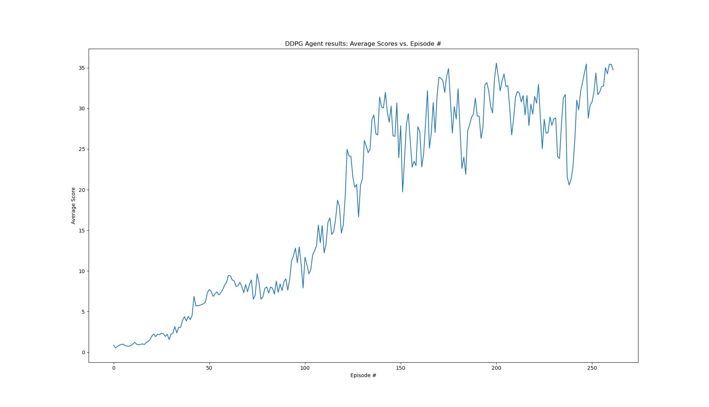
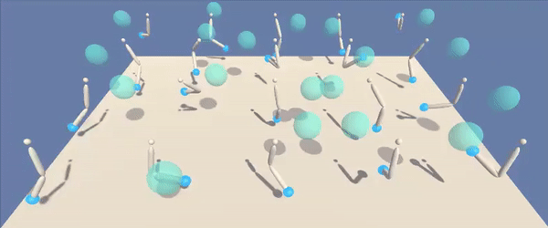

# Report

This report discusses the points listed below in greater detail:
1.  Background on DDPG
    1.  Value-based Methods
        1.  Q-Learning
        1.  Deep Learning
        1.  DQN - Deep Q-Network
    1.  Policy-Based Reinforcement Learning
    1.  DDPG-Algorithm
        1. Critic
        1. Actor
        1. Update-Rule
2.  Empirical Results
    2.  Score-vs-Episode-Plot
    2.  GIFs showing
        2.  the agent's performance **before** training 
        2.  the agent's performance **after** training        
3.  Implementation
    3.  Neural Network Architectures
        3. Critic
        3. Actor
    3.  Hyperparameters
4.  Possible Future Improvements
    4.  Prioritised Experience Replay
    4.  GAE: Generalized Advantage Estimation

## Background on DDPG

The DDPG-algorithm used here is described in a paper by Deepmind back in 2016 and was published at the ICLR 2016 conference: 
https://arxiv.org/abs/1509.02971

DDPG (Deep Deterministic Policy Gradient) is an approach in reinforcement learning that effectively adapts the ideas of Deep Q-networks (DQNs) towards the continuous action domain.

It brings together the ideas from DQN and Actor-Critic methods and we are going to expand a little on these techniques in the following sections:

Let's start with the description of value-based methods which DQNs belong to:

### Value-based Methods

#### Q-Learning

In classical reinforcement learning, the goal is to teach an agent to navigate a new environment with the goal of maximising cumulative rewards. One approach is Q-learning, where the agent tries to learn the dynamics of the environment by assigning values to <state, action>-pairs for the environment under test. This is achieved over the course of training, using its experiences to produce and improve these estimates: As the agent encounters <state, action>-pairs more often, it becomes more and more "confident" of their value. In the end, an optimal policy can be obtained iteratively by starting from any state and always choosing that action that maximises the <state, action>-value for that state. However, this approach is only applicable to a discrete or a low-dimensional action space, respectively, and this is where DDPG comes into play to make up for this insufficiency.

#### Deep Learning

Deep Learning is a part of a broader family of machine learning methods and is based upon deep artificial neural networks. The latter have frequently been used to obtain or even surpass human level performance. An artificial neural network usually follows a layered architecture. This means that every neuron in a layer of neurons is connected to every neuron from the preceding and subsequent layer, respectively. *Deep* in this context refers to the number of layers within the artificial neural networks and usually points out that a huge number of layers is available. Artificial neural networks lend themselves to solve tasks in a supervised, unsupervised or semi-supervised manner and solve them completely autonomously, provided a sufficient amount of data is available to train them.

#### DQN - Deep Q-Network

DQN is a combination of Q-Learning and Deep Learning and can be considered a representative of a value-based method. In DQN, the Q-tables known from classical Q-learning are substituted with artificial neural networks in order to have them learn the values of <state, action>-pairs directly. Moreover, they are trained with an agent's experiences it has collected during its exploration of the environment. These experiences serve as a reusable form of training data. This kind of training is also known as an *off-policy* approach, as the agent learns from samples that do not directly result from following the agent's policy, but rather from temporally uncorrelated samples. A policy itself can be thought of as an agent's strategy for deciding which action to take next when being in a given state.

### Policy-Based Reinforcement Learning

Unlike Q-Learning, that tries to estimate the value of a <state, action>-pair, policy-based reinforcement learning aims at learning the best policy directly without an auxiliary Q-table, buf usually suffer from a huge variance with respect to the expected cumulative reward. Further, one can distinguish between *stochastic* and *deterministic* policies. The former one takes in a state and returns a probability distributions over the possible actions. The latter one takes in a state and returns a single action without stochasticity.

### DDPG-Algorithm:

**The DDPG-algorithm itself expands the ideas mentioned in the paper *Deterministic Policy Gradient Algorithms* by David Silver et al. from Deepmind back in 2014 (http://proceedings.mlr.press/v32/silver14.pdf) and is a representative of an actor-critic method that is composed of several components:**

Actor-Critic methods are at the intersection between value-based and policy-based methods. On the one hand, you have a *critic* that tries to estimate the <state, action>-value and follows the value-based approach, while on the other hand, you have an *actor* that tries to prescribe an action to every state input to the actor. The latter obviously follows the policy-based approach. Since value-based methods usually exhibit less variance than policy-based methods do, the actor-critic approach tries to decrease the amount of variance with respect to the expected cumulative reward and usually speeds up training.

The DDPG-algorithm works as follows:

1. Initialize a trainable critic and actor network with random weights, respectively.
2. Initialize two target networks, one for the critic and one for the actor. These can be just copies of the untrained critic and actor networks created in the first step.
3. The four networks created in steps 1 & 2 are input to the DDPG-agent.
4. Initialize a replay buffer for experience collection & replay.
5. A major challenge of learning in continuous action spaces is exploration. Therefore, for every new episode initialize a random process N for action exploration, like an *Ornstein-Uhlenbeck* process, for example, to generate temporally correlated exploration. The output from the random process is added to the actor's prescribed action.
6. Apply an action to the environment and receive observations like, new state and rewards and store the <state, action, reward, next_state>-tuples in the replay buffer.
7. During interaction with the environment make the agent learn from minibatch-experiences sampled from the replay buffer.
8. Repeat steps 5. to 7. until convergence. 

The learning process itself is explained in the following:

#### Critic

After we've collected enough experiences (i.e. <state, action, reward, next_state>-tuples) we first start updating the critic. 

This is achieved by sampling some of our experiences and then computing the empirically observed estimates of the <state, action>-values compared to those estimated from the critic. 
The empirically observed estimates are calculated by, first, estimating the next action via the target actor model applied to the next state. This estimate for the next action is then used in a second step to calculate an estimate for the empirically observed <state, action>-value itself using the target critic model applied to the tuple consisting of the next state and the estimated next action from the previous step.
 
The difference between the empirically observed estimate of the <state, action>-value and its direct estimate from the actual critic model is known as the TD-error. 
Subsequently, the critic's model weights are updated in such a way as to reduce this error via the backpropagation-algorithm. 
The whole procedure is then repeated iteratively, effectively reducing the error over time until convergence is achieved.

#### Actor

The actor, by contrast, is optimized by calculating the *sampled policy gradient*. The latter is given as the gradient of the expected return from the start distribution with respect to the **actor's** parameters. To be more precise, it can be calculated as the gradient of the trainable critic model with respect to the actor's model weights. Then an average value of this gradient is calculated for the minibatch of samples experiences from the replay buffer.
Subsequently, the actor's model weights are updated in such a way as to reduce this error via the backpropagation-algorithm, as we did for the critic. 
The whole procedure is then repeated iteratively, effectively reducing the error over time until convergence is achieved.

#### Update-Rule

At end of each timestep, the target networks are updated in a way that is known as *soft-updates*. This means, that only a TAU-th proportion of the trainable and recently updated model weights are added to the target model weights at the expense of the target model weights, which themselves have been rescaled by (1-TAU).

**A list of more refined versions of the DDPG-algorithm can be found in the *"Possible Future Improvements"*-section together with brief descriptions**.

## Empirical Results

**So far, we simply made use of the vanilla DDPG-algorithm with gradient norm clipping to 1 in order to make training more stable.**
Below, you find some empirical results for our vanilla DDPG-algorithm.

### Score-vs-Episode-Plot

We found that after 162 episodes, the agent can be considered to have 'solved' the environment as it attained an average reward over 100 episodes greater than 30.

A plot of score vs episode is shown below:

### GIFs showing

#### the agent's performance before training

#### the agent's performance after training

## Implementation

### Neural Network Architectures

Overall, we chose standard fully-connected, feed-forward neural networks with the following parameters for the critic and the actor, respectively:

#### Critic

1.  Input layer consisting of 37 neurons (33 + 4 concatenated neurons).
    1. 33 neurons thereof represent the 33-dimensional state vector input to our critic network.
    1. 4 neurons represent the 4-dimensional action vector input to our critic network.
2.  Two hidden layers with 40 & 20 neurons, respectively, with ReLU-activation function each.
3.  One single output layer with 1 neuron representing the value of the (state, action) tuple with no (i.e. linear) activation function (the output can take on both positive and negative values.)

#### Actor

1.  Input layer consisting of 33 neurons simply representing the 33-dimensional state vector input to our actor network.
2.  Two hidden layers with 40 & 20 neurons, respectively, with ReLU-activation function each.
3.  One single output layer with 4 neurons representing the 4-dimensional action vector with tanh activation function. The latter is necessary to bound the action values to values between -1 and 1.

### Hyperparameters

Here, we would like to discuss the hyperparameters occurring in the DDPG-algorithm briefly:

**max_episodes (int): maximum number of training episodes**\
We chose 300 episodes.

**max_timesteps (int): maximum number of timesteps per episode**\
We chose 1000 timesteps.

**GAMMA (float): discount rate**\
A value close to 1 will make the agent weight future rewards as strongly as immediate rewards, while a value close to 0 will make the agent only focus on immediate rewards. Here, we chose gamma to be 0.99.

**LR_ACTOR (float): model hyperparameter - learning rate**\
This determines the magnitude of actor model weight updates. If chosen too large a value, then the learning is likely to become unstable, while chosen too small a value, the model may never converge. Therefore, we chose LR_ACTOR to be 1e-4, which is a more or less common choice in Deep Learning.

**LR_CRITIC (float): model hyperparameter - learning rate**\
This determines the magnitude of critic model weight updates. If chosen too large a value, then the learning is likely to become unstable, while chosen too small a value, the model may never converge. Therefore, we chose LR_CRITIC to be 1e-3, which makes the critic learn a bit faster than the actor.

**WEIGHT_DECAY (float): critic model hyperparamter - L2-regularization strength**\
This determines by how much the weights of the critic model get L2-regularized. If chosen too large a value, then the weights will be nearly zero and the overall model is rather rigid encouraging underfitting, while chosen too small a value, the model weights are more or less unbounded which could favour overfitting. Here, we chose a WEIGHT_DECAY to be 0, which does not make use of L2-regularization at all for the critic model.  

**BATCH_SIZE (int): model hyperparameter - number of experiences sampled for a model minibatch**\
Too low will cause learning instability and poor convergence, too high can cause convergence to local optima. Here, we chose 64 as batch size.

**BUFFER_SIZE (int): replay buffer size**\
this is the size of the experience buffer and represents the size of the memory the agent can sample from for learning. Here, we chose a buffer size of 1E5.

**TAU (float): how closely shall the target network follow the current network in terms of weights?**\
After every learning step, the target-network weights get updated with a fraction tau of the current network weights. Therefore, the target-network weights are a moving average over time of the current network weights. Here, we chose a value of 1e-3.

## Possible Future Improvements

The following list of modifications and refined approaches may render themselves beneficial for obtaining even better performance than obtained with the DDPG-algorithm presented and implemented here:

### Prioritised Experience Replay

In order to produce training data we store all <state, action, reward, next_state>-tuples as experiences and then sample them randomly each time we update the model. Note, that some of these may be more valuable for learning than others. For instance, an agent may have plenty of experiences from the starting state but relatively little from more rare states. In this modification we use how 'surprising' an observed <state, action>-value is as a measure of how 'useful' learning from it is. Formally, this usefulness can be modeled by the absolute difference between the value we observed for it (i.e. the target value) and the value our model assigns to it (i.e. the estimated value).

Read more: https://arxiv.org/abs/1511.05952

### GAE: Generalized Advantage Estimation

The quality of the critic's estimate of the <state, action>-value is believed to increase, as we increment the step width of the n-step-bootstrapping approach. 
As discussed in the paper below, the *GAE: Generalized Advantage Estimation*-approach promises to tackle all different versions of n-step-bootstrapping at once just by forming a mixture of exponentially decaying factors across the different n-step bootstrapping estimates. This is done by adjusting another hyperparameter, called *lambda*. 
The mixture is taylored such that for *lambda = 0* it is equivalent to the TD-estimate, that is biased, whereas for *lambda = 1* it reproduces the Monte-Carlo-estimate, that is completely unbiased.

Read more: https://arxiv.org/abs/1506.02438